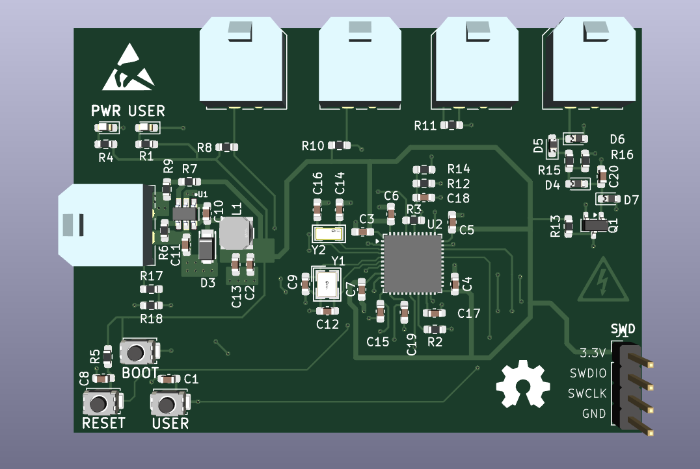
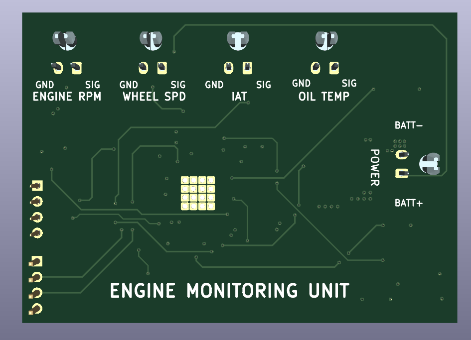
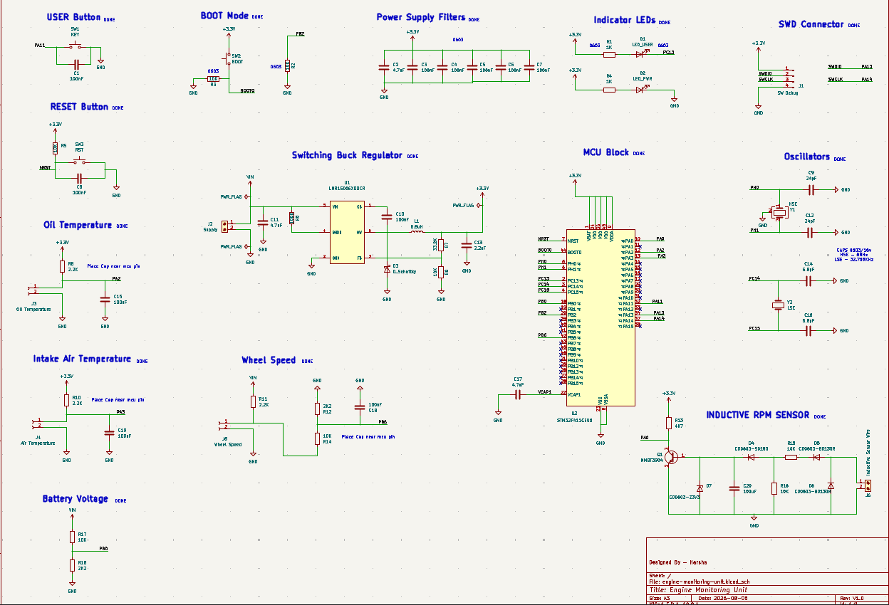

# Engine Monitoring Unit (EMU) 🏍️⚡

[](https://www.kicad.org/)
[](https://www.st.com/)
[](#pcb-stackup--layout)
[](#mechanical--connectors)
[](LICENSE)

An open-source, automotive-grade **Engine Monitoring Unit (EMU)** designed to bring real-time engine telemetry and diagnostics to air-cooled single-cylinder motorcycles (such as the Hero Passion Plus) that lack factory instrumentation.

Powered by an **STM32F411CEU6** ARM Cortex-M4 microcontroller, this unit captures vital thermal, electrical, and rotational parameters and displays them on a handlebar-mounted OLED screen—giving riders full visibility over engine health during long highway cruises and touring trips.

---

## 📌 Gallery

| Top 3D Render | Bottom 3D Render |
| :---: | :---: |
|  |  |

---

## 🎯 Motivation & Objectives

Stock commuter motorcycles often lack essential monitoring tools, providing only a basic speedometer and fuel gauge. When pushing small-displacement air-cooled engines on long rides or steep climbs, thermal overload or electrical failure can happen without warning.

This project solves that real-world problem by providing:
1. **Real-time Engine Health Visibility:** Monitoring oil temperature and intake air temperature (IAT) to prevent overheating.
2. **Electrical System Telemetry:** Tracking live battery voltage to monitor stator and regulator/rectifier performance.
3. **Engine Dynamics:** Accurate engine RPM via inductive pulse pickup and wheel speed tracking.
4. **Automotive EMI Immunity:** Designed specifically for high noise/vibration motorcycle chassis environments.
5. **Zero Parasitic Battery Drain:** Tied directly to switched ignition (+12V)—completely powered down when the key is OFF.

---

## 🛠️ Key Technical Specifications

| Parameter | Specification | Description |
| :--- | :--- | :--- |
| **Microcontroller** | STM32F411CEU6 | 100 MHz ARM Cortex-M4, 512KB Flash, 128KB SRAM |
| **Operating Voltage** | 12V DC nominal (Switched) | Powered directly from motorcycle ignition bus |
| **On-board Power** | LMR16006 Buck Converter | 12V → 3.3V Step-down (60V Max $V_{IN}$) |
| **Current Draw** | < 0.6A Operating | 0A Off-state (Zero parasitic load) |
| **PCB Stackup** | 4-Layer | Top (Sig/Pwr) - GND - GND - Bottom (Sig) |
| **Connectors** | Molex Micro-Fit 3.0 | Positive-locking, high-vibration automotive rating |
| **Display Interface** | 0.96" I2C OLED | 4-pin header (3.3V, SDA, SCL, GND) |
| **Debug Interface** | SWD | 4-pin header (3.3V, SWDIO, SWCLK, GND) |

---

## 📐 System Architecture & Schematic Overview



### Circuit Block Summary:
* **Power Supply:** Uses a high-efficiency **LMR16006** synchronous buck regulator stepping down battery voltage to $+3.3\text{V}$ for the MCU and OLED display.
* **Microcontroller Core:** Minimalist STM32F411 layout with external $8\text{ MHz}$ HSE crystal ($Y_1$) and $32.768\text{ kHz}$ LSE crystal ($Y_2$), full decoupling capacitor network ($C_2 - C_7$), and pull-up/down logic for BOOT0/NRST.
* **Inductive RPM Conditioning:** Discrete NPN transistor ($Q_1$) amplifier stage paired with high-speed clamping diodes ($D_4 - D_7$) to cleanly condition high-voltage spark-plug coil inductive pulses into a 3.3V digital square wave.
* **Analog Sensor Inputs:** Resistive voltage dividers and $100\text{ nF}$ filtering capacitors for Oil Temp ($J_3$), Intake Air Temp ($J_4$), and Battery Voltage sensing ($J_2$).
* **Wheel Speed Conditioning:** Digital pulse input circuit with pull-up and low-pass filtering for hall-effect or reed switch wheel sensors ($J_5$).

---

## 📑 PCB Stackup & Layer Breakdown

To withstand the severe Electromagnetic Interference (EMI) generated by motorcycle ignition coils and spark plugs, the PCB utilizes a dedicated **4-layer stackup** with dual continuous internal ground planes.

```text
┌─────────────────────────────────────────────────────────┐
│ Layer 1: Top Layer (FCU)    -> Signals + 3.3V Power     │
├─────────────────────────────────────────────────────────┤
│ Layer 2: Inner 1 (In1)      -> Solid Ground Plane (GND) │
├─────────────────────────────────────────────────────────┤
│ Layer 3: Inner 2 (In2)      -> Solid Ground Plane (GND) │
├─────────────────────────────────────────────────────────┤
│ Layer 4: Bottom Layer (BCU) -> Signal Routing           │
└─────────────────────────────────────────────────────────┘
